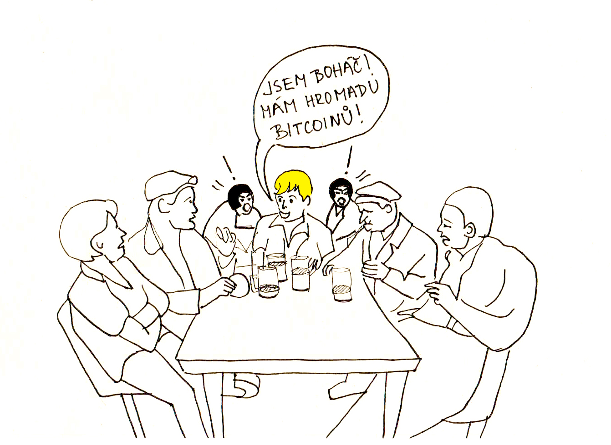
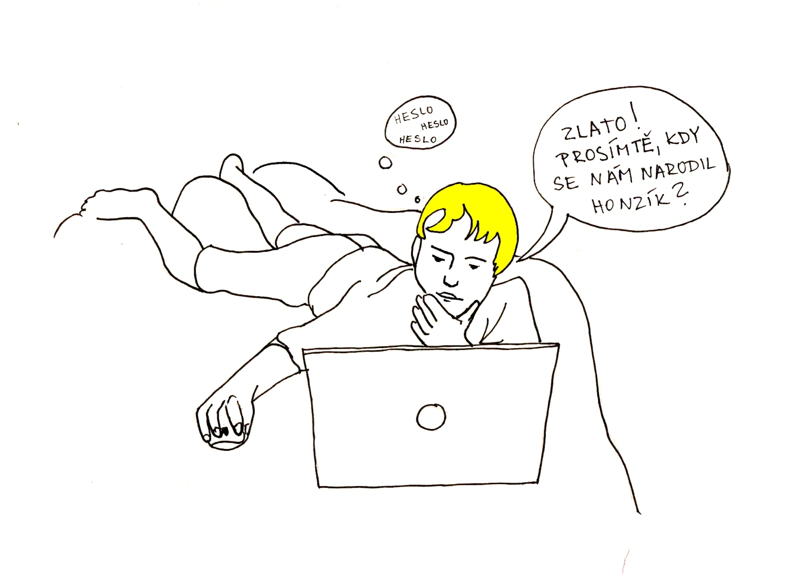
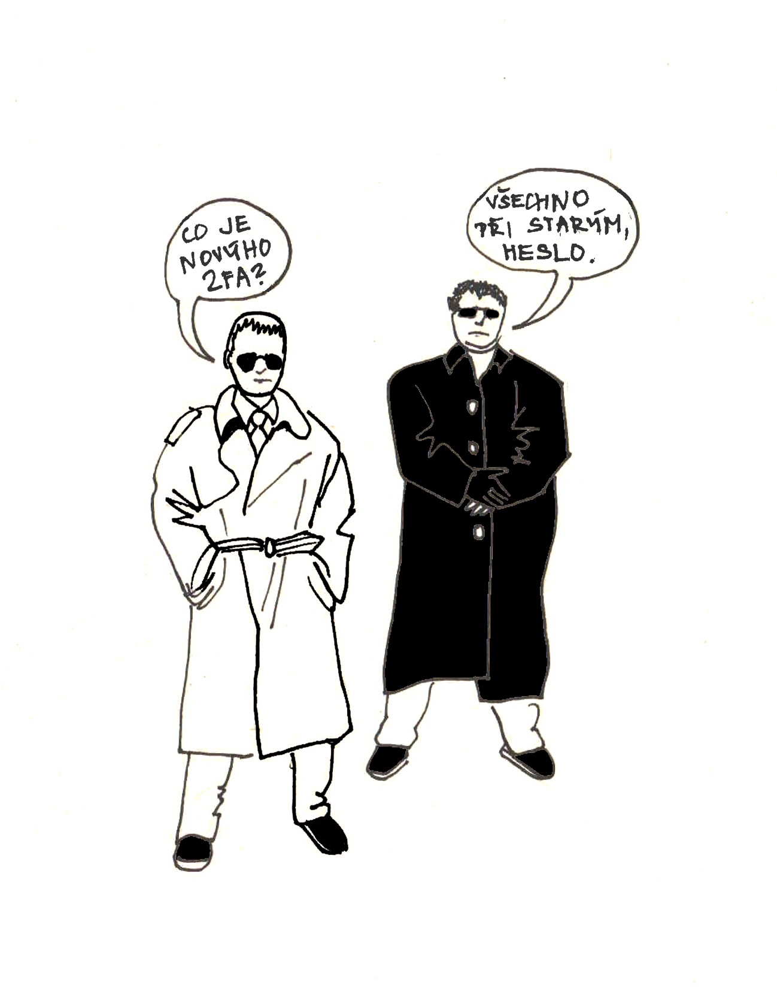
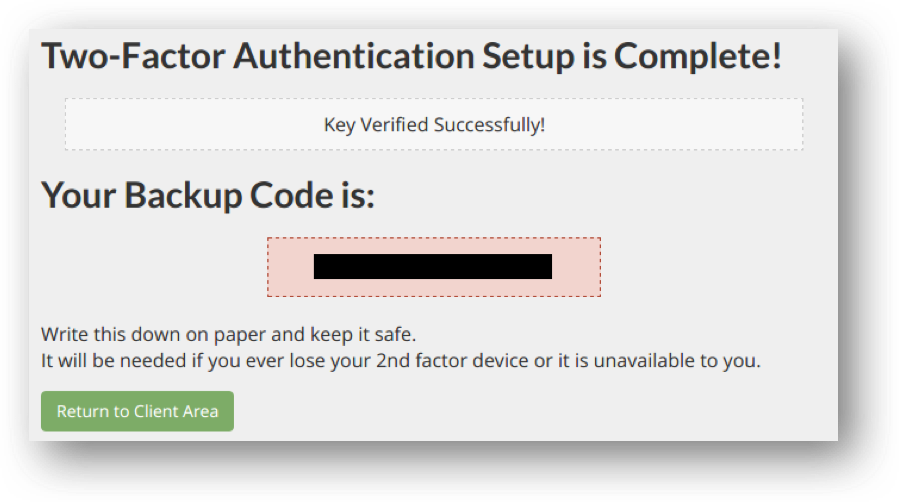
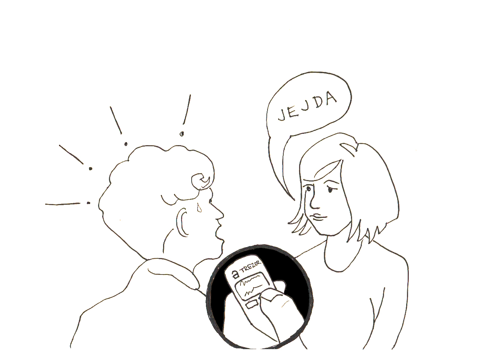

# Obecná doporučení

## Jak se pohybovat v prostředí internetu

Velká část z následujících doporučení se netýká pouze kryptoměn, ale  obecně pohybu v prostředí na internetu. Přestože se vám mohou jevit jako samozřejmé, je dobré si je připomenout. Pro práci s kryptoměnami jsou totiž níže uvedená doporučení úplným základem, bez kterého rozumné úrovně bezpečnosti nikdy nedosáhnete.

## Nechvástejte se

Na veřejnosti neuvádějte, kolik a jakých kryptoměn vlastníte, ani jak moc jste na nich vydělali (či prodělali). Zejména nic takového nepište na sociální sítě.

Nikdy nevíte, jak s takovou informací naloží ostatní. V lepším případě se vystavujete riziku závisti a v horším, že se stanete obětí trestného činu (loupež, vydírání, únos apod.).

## Citlívé informace neukládejte online

Chcete-li, aby se k daným informacím nedostaly nežádoucí osoby, nikdy tyto informace neukládejte v online prostředí. Online prostředím je přitom každé prostředí, v rámci kterého dochází k připojení k internetu (služby jako je váš e-mailový účet, úložiště typu dropbox, ale i harddisk počítače připojeného k internetu).

Neexistuje 100% zabezpečení, které by v prostředí internetu zabránilo útoku třetí strany a získání informací. Není-li proto nezbytně nutné uchovávat informace online, je takový postup zbytečným zvýšením rizika hackerského útoku. Obyčejný papír je v řadě případů stále bezpečnější řešení!

## Používejte správce hesel

Pro registrace ke všem online službám používejte nová a dostatečně silná hesla, která si ukládejte do některého z manažerů hesel.

Opakování stejných hesel nebo používání jednoduchých hesel, která se nám skvěle pamatují, je častým důvodem nabourání bezpečnosti a odcizení kryptoměn (typicky z účtů na kryptoměnových burzách). Vzhledem k tomu, že nikdo z nás si nedokáže zapamatovat velké množství silných hesel, je vhodné používat tzv. správce hesel, jako jsou např. Trezor password manager, LastPass, Keeper, 1Password, apod. Nechcete-li spoléhat na služby poskytovatelů – třetích osob, využijte softwarových řešení, které používají šifrování a lze je uložit na vlastní počítač.

## Používejte 2FA

Kromě hesla zabezpečte své online účty i s pomocí 2FA, jako je Google Authenticator nebo Authy.

Two-factor authentication (2FA) je způsob jak vlastní účty a přístup k informacím dodatečně zabezpečit. Používání 2FA zásadním způsobem zvyšuje vaši bezpečnost, neboť útočník musí kromě primárního hesla překonat i druhou překážku, a sice získání krátkodobě platného sekundárního autentizačního kódu. Tento kód se periodicky generuje například pomocí jedné z uvedených aplikací ve vašem mobilním telefonu.
Pokud můžete, je vhodné se vyhnout využívání 2FA prostřednictvím SMS, a to s ohledem na případné možnosti krádeže identity prostřednictvím operátora.

## Uchovávejte zálohy 2FA

Při nastavení 2FA je vhodné si offline uchovat zálohy pro případ obnovení (např. vytištěním QR kódu nebo opisem textové podoby zálohy).

Nastavením 2FA obvykle svážete získání autentifikačního kódu s vašim konkrétním zařízením (telefonem). V případě, že telefon ztratíte nebo dojde k jeho zničení, není možné kód získat jiným způsobem než prostřednictvím zálohy. Nemáte-li ji, je nutná zpravidla poměrně složitá a zdlouhavá komunikace s provozovatelem předmětné služby, který by měl řádně ověřit, že o obnovení přístupu žádá skutečně vaše osoba (a nikoliv případný útočník).

## Uvědomte si, že transakce nelze vrátit

Buďte obezřetnější než při obvyklých finančních transakcích. Dávejte pozor, komu a co odesíláte. Používáte-li danou službu poprvé, věnujte alespoň několik minut hledání informací o službě a zkušeností jiných zákazníků dostupných na internetu.

Odhaduje se, že 2,7 až 3,8 mil. BTC je nevratně ztraceno. Jakmile provedete kryptoměnovou transakci na cizí adresu, nevratně ztrácíte kontrolu nad danými prostředky. Neexistuje žádná třetí osoba, která by vám v případě problémů pomohla transakci zvrátit. Vyplatí se tedy vždy pořádně zvážit komu, kam a proč kryptoměnu odesíláte. U kryptoměn jednoznačně platí dvakrát měř a jednou řež! 

