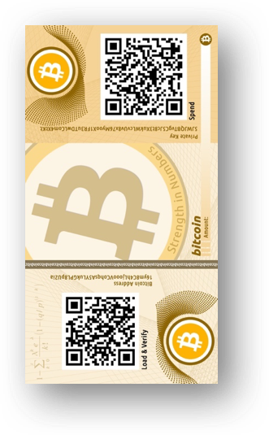

# Peňeženky a způsoby uložení

Jak uchovávat kryptoměny?

Následující doporučení se týkají nakládání s vašimi kryptoměnami, tj. výběru a používání tzv. kryptoměnových peněženek. 

Kryptoměnové peněženky spravují údaje, které jsou nezbytné pro zajištění přístupu ke kryptoměnám a jejich převodům. Jedná se zejména o tzv. soukromé a veřejné klíče.

## Zvolte vhodnou peněženku

Různé typy peněženek s sebou nesou odlišné klady a zápory. Je vhodné zvolit takovou peněženku, která vyhovuje vašim konkrétním potřebám a způsobu využití.

Hardwarová, softwarová i papírová peněženka mají odlišné vlastnosti z hlediska bezpečnosti i způsobů využití. Pro rozdílné účely a objemy je proto vhodné využívat jiné typy peněženek.

Výhodou hardwarové peněženky je zejména offline správa soukromých klíčů v zařízení. Na rozdíl od počítače či mobilního telefonu je zařízení od počátku navrženo tak, aby vaše soukromé klíče chránilo nejen před hackerským útokem, ale i fyzickou ztrátou. Hardwarové peněženky jsou pro běžného uživatele jednoznačně nejbezpečnějším řešením. Současně sofistikované hardwarové peněženky nabízí celou řadu funkcí, od těch pro začínající uživatele po ty pokročilejší.

Softwarové peněženky lze rozdělit na mobilní a desktopové. Oba druhy jsou s ohledem na uchování privátních klíčů v online prostředí nevhodné pro uložení větších částek. Mobilní peněženky se skvěle hodí pro méně hodnotné platby, jako např. za kávu v Paralelní Polis. Lze je vnímat jako obdobu vaší skutečné peněženky. Nenosíte v ní své úspory na penzi, ale máte v ní vždy hotovost na malý nákup a nějaký ten drink. Desktopové peněženky na počítačích připojených k internetu jsou na tom podobně jako mobilní. Desktopová peněženka pro vás nicméně může být atraktivní, pokud se chcete ve větším detailu seznámit s technickým fungováním zvolené kryptoměny. Řada desktopových peněženek vám umožní stáhnout si do počítače celý blockchain (full node) nebo si na vlastní riziko hrát v příkazovém řádku.

Papírové peněženky mohou mít mnoho využití a zároveň i vysoký bezpečnostní standard. Pro většinu lidí je však složité dosáhnout jejich bezpečnostního potenciálu, a proto jsou vhodné způsoby použití poměrně omezené.

## Používejte ověřená a svobodná řešení

Pro spolehlivou úschovu kryptoměn používejte vždy řešení, která jsou již náležitě otestovaná a svobodná (např. peněženky, které jsou na trhu delší dobu).

Nové produkty a společnosti mohou slibovat vylepšené funkcionality a pohodlnější řešení. Volba vhodné peněženky je však především otázkou bezpečnosti a „časový“ test je často tím hlavním vypovídajícím faktorem.

Svobodný software obvykle umožňuje uživatelům používat program pro jakýkoli účel, dále jej distribuovat a také studovat a měnit software díky otevřenému zdrojovému kódu. Právě přístup ke zdrojovému kódu (prvek „open-source“ dává ostatním programátorům možnost nezávisle ověřit, co program skutečně provádí, najít možné nedostatky v jeho kódu a případně vydat vlastní vylepšené verze.

## Peněženky pořizujte od důvěryhodného zdroje

Jelikož peněženka spravuje vaše kryptoměny, musíte věřit tomu, kdo vám peněženku, ať již softwarovou či hardwarovou poskytl. Útočník může peněženku sám upravit (hacknout) nebo vám rovnou poskytnout zcela falešnou peněženku, a to především za účelem krádeže vašich kryptoměn.

Hardwarové peněženky jsou zpravidla zabaleny v zapečetěném obalu, aby bylo možné ověřit jejich autenticitu, tj. že pochází přímo od výrobce a nebylo s nimi před jejich dodáním manipulováno. Současně je vhodné tyto peněženky pořizovat přímo přes e-shop výrobce, případně přes jiného vysoce důvěryhodného dodavatele. Pořízení hardwarové peněženky z druhé ruky za účelem bezpečného uchování kryptoměn není vhodné. Softwarové peněženky je obdobně nutné stahovat z důvěryhodných zdrojů. Podobně můžete přijít o své kryptoměny při generování papírové peněženky pomocí falešného či pozměněného programu.

## Buďte opatrní při využívaní prostředníků

Uložení kryptoměn u prostředníka (např. kryptoměnové burzy) s sebou nese výhody i nevýhody. Vydáte-li se touto cestou, dobře zvažte možné důsledky a zejména jakou část svého portfolia chcete tímto zásadním způsobem vystavit riziku.

S vlastní kontrolou nad kryptoměnami se pojí řada rizik. Není proto nic překvapivého, že řada lidí své kryptoměny ukládá u třetích osob, jako jsou kryptoměnové burzy. V takovém případě se však prakticky zcela spoléháte na poctivost a zejména solventnost takového správce. Případů vykradených kryptoměnových burz, ať již člověkem zevnitř nebo zvenčí, je nespočet. Nadto se mohou burzy ocitnout v problémech a insolvenci i z celé řady jiných důvodů. Rovněž pokud máte strach z všudypřítomného pronásledování ze strany NSA, CIA, FBI nebo jen českých exekutorů, dlouhodobě uložit své kryptoměny na burze, kde se v dnešní době zpravidla musíte vcelku důsledně identifikovat, není nejmoudřejší.

Jak říká jeden z nejpřesvědčivějších obhájců Bitcoinu, Andreas Antonopoulos: „Not your keys? Not your bitcoin.“. Pokud se vám tato pozice zdá jako přehnaná, uvědomte si, že i z právního pohledu převodem kryptoměny na burzu obvykle přestáváte být vlastníkem konkrétní kryptoměny a vzniká vám pouhá pohledávka za burzou na vydání odpovídající hodnoty. Pokud nadto připustíme, že původním záměrem Bitcoinu bylo vytvořit peer-to-peer platební systém, který lze využívat bez nutnosti prostředníka, pak nechávat jakoukoliv podstatnější kryptočástku na burze je do jisté míry popřením samotného smyslu existence kryptoměn.

## Používejte dostatečně bezpečný PIN

Umožňuje-li peněženka nastavení PINu, využijte této možnosti. Nepoužívejte přitom jednoduché PINy, jako jsou např. sekvence (1234) nebo opakovaná čísla (3333). V ideálním případě používejte alespoň šestimístný PIN s různými čísly.

Použitím jednoduchého PINu se výrazně snižuje bezpečnost v případě fyzického získání daného zařízení. Zkouší-li útočník PINy metodou „brute force“, obvykle začíná těmi nejjednoduššími.

## Nespoléhejte na jedinou technologii

Nesázejte všechno na jednu kartu a nevěřte jen jedné technologii. Diverzifikujte mezi různými druhy peněženek.

Byť se může určitá peněženka jevit jako nejlepší a nejbezpečnější řešení, u každé existuje riziko zneužití, chyby apod. Chcete-li minimalizovat riziko rozsáhlé ztráty, rozdělte své prostředky mezi různé druhy a výrobce peněženek!

## Buďte opatrní s papírovými peněženkami

Nejste-li bezpečnostními experty s potřebnými technickými dovednostmi, vyhněte se používání papírové peněženky pro úschovu větších částek.

Papírové peněženky („paper wallet“) jsou historicky populárním řešením, a to nejen pro nízké náklady na jejich výrobu. Mnohdy jsou dokonce považované za „nejbezpečnější“ formu úschovy kryptoměny. Jejich problém je však ve splnění předpokladů pro dosažení maximální úrovně bezpečnosti, a sice zejména vytvoření privátních klíčů v bezpečném prostředí (např. důvěryhodný software, dedikovaný offline počítač, zabezpečená tiskárna atp.). Bezpečné vytvoření papírové peněženky tedy rozhodně není triviální, a proto jsou tyto peněženky u větších částek pro běžného uživatele nevhodné. Naopak se však mohou dobře hodit pro darování menších obnosů vašim blízkým.

## Mějte hardware peněženky pod dohledem

Používáte-li hardwarové peněženky, snažte se je mít pod dohledem a bez přístupu třetích osob.

I když jsou hardwarové peněženky vytvořeny k bezpečnému držení kryptoměn a obvykle jsou chráněny PINem, nelze vyloučit, že chráněná tajemství lze ze zařízení i přesto získat, a to zejména získá-li útočník fyzický přístup k peněžence. Ostatně taková zranitelnost byla již několikrát zjištěna. Výrobci následně, je-li to možné, reagují na zranitelnost vydáním nového firmware.

