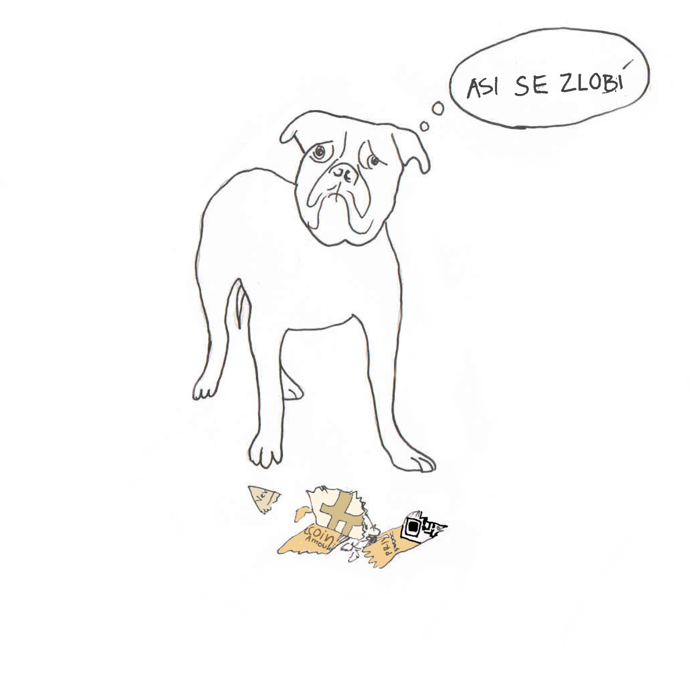
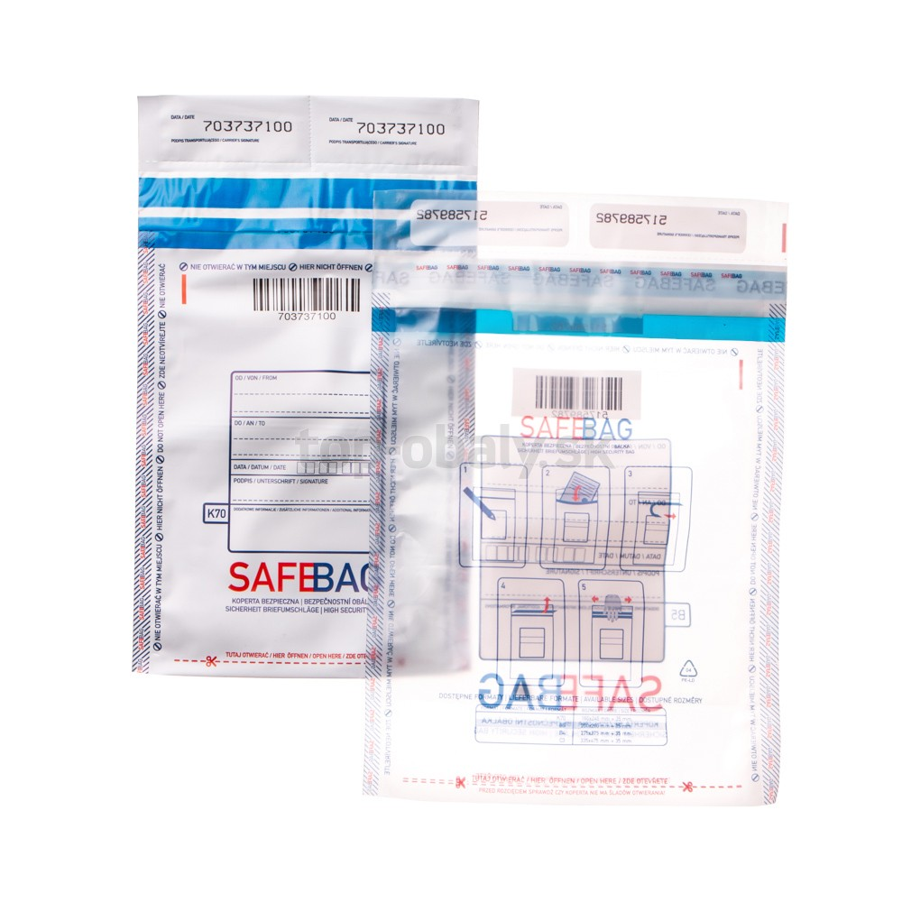
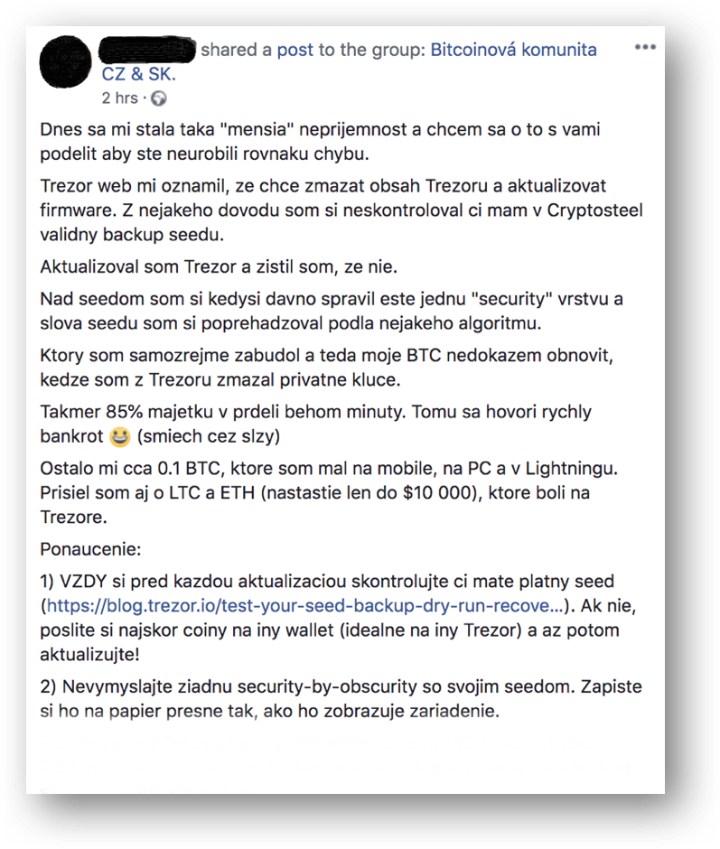

# Zálohy peněženek

Jak pracovat se zálohami

V posledních letech došlo k významnému posunu z hlediska bezpečnosti správy privátních klíčů, a to především díky dostupné nabídce stále sofistikovanějších a současně uživatelsky přívětivějších hardwarových peněženek. Peněženky nejen stále umožňují nové a nové funkce, ale rovněž snižují riziko lidské chyby. I tak je u většiny hardwarových peněženek při jejich prvotním nastavení nutné vytvoři zálohu.

Vygenerovanou zálohu (anglicky tzv. recovery seed či seed phrase) tvoří obvykle 12 nebo 24 anglických slov. Tato slova jsou nesmírně důležitá. S jejich znalostí, nejsou-li současně využity další nadstandardní bezpečnostní opatření typu heslové fráze (viz dále), je možné obsah peněženky obnovit a získat tím přístup k veškerým v ní uloženým prostředkům. Nakonec tak celá bezpečnost nastaveného řešení může být závislá na způsobu uchování této zálohy. Nejen, že nechcete zálohu ztratit, ale současně k ní nesmí získat přístup žádná nepovolaná osoba. Právě proto je úschově záloh nutné věnovat náležitou pozornost.

## Zálohu zaznaménavejte offline

Zálohy zaznamenávejte a ukládejte mimo prostředí internetu, zejména ne v e-mailu, dropboxu apod.

Uložíte-li zaznamenaná slova v elektronické podobě online, vystavujete se zcela zbytečnému riziku, že k nim získá přístup neoprávněná osoba (o čemž se navíc obvykle ani nedozvíte). Neopomíjejte, že online prostředí tvoří i harddisk ve vašem počítači, který využíváte byť i jen příležitostně k prohlížení internetu. Ideální způsob pro zaznamenání zálohy tak může být propiska a papír, jak popisujeme na další stránce. 

## Dávejte pozor při vytváření zálohy

Pořizujte zálohu, jen jste-li sami a v uzavřeném prostoru bez kamer. Slova zálohy při zapisování nevyslovujte nahlas.
Uvědomte si, že stěny mají doslova uši i oči. Ve veřejném prostoru je mnoho kamer a všude kolem nás jsou zařízení zaznamenávající zvuk. Okamžik zapisování zálohy je sám o sobě bezpečností riziko, věnujte mu tedy náležitou pozornost. Okamžitě po pořízení zálohy ji uložte tak, aby k ní neměly přístup jiné osoby.

## Zálohu uchovávejte ve vhodné podobě

Slova zálohy zaznamenejte na papír nebo ještě lépe na jiné materiály, které nepodléhají zkáze (typicky vyražení slov do kovových destiček).

Záloha slouží především pro vás, a to pro případ, že se s peněženkou cokoliv stane (ztráta, vymazání při aktualizaci firmwaru, fyzická destrukce, odcizení apod.). V takovém případě budete rádi za to, že máte zálohu bezpečně uschovanou a v čitelné podobě. Pro zajištění použitelnosti i po delší době je vhodné používat prostředky, které není možné jednoduše smazat (např. propiska na místo obyčejné tužky). Za ideální lze považovat produkty, které chrání zálohu i před vnějšími vlivy (oheň, voda apod.), jako je např. Cryptosteel a další.

## Používejte bezpečnostní obálky

Pro uchování záloh používejte tzv. bezpečnostní obálky, a to ideálně ty, které obsahují unikátní identifikační číslo.

Dostane-li se jiná osoba k vaší záloze, může získat přístup k předmětným kryptoměnám. Stačí přitom, aby si zálohu vyfotila, opsala nebo zapamatovala. Může se tak jednoduše stát, že při následné kontrole existence zálohy vůbec nepoznáte, že někdo s vaší zálohou v mezidobí manipuloval. Proto je vhodné využívat tzv. bezpečnostní obálky, které obvykle slouží k zasílání cenných a tajných zásilek a jsou navrženy tak, aby bylo možné vždy ověřit, zda (ne)došlo k neoprávněné manipulaci. Tyto obálky jsou neprůhledné a zalepené tak, že je nutné je při otevření nevratně porušit.

Unikátní identifikátor bezpečnostní obálky (viz např. níže na obrázku číslo 703737100) si při uložení zálohy poznamenejte. Během následné kontroly můžete jeho porovnáním ověřit, zda nedošlo k otevření a výměně obálky za jinou. Obálku je ze stejného důvodu vhodné podepsat.

## Pravidelné zálohy kontroluje

Stanovte si termíny, ve kterých zkontrolujete existenci vašich záloh a skutečnost, že s nimi v mezidobí nemanipulovala neoprávněná osoba.

Při jakkoliv bezpečném nastavení systému uložení záloh může nastat situace, kterou jste nepředvídali. Zálohu například může někdo odcizit, může dojít k jejímu poškození nebo ztrátě. Abyste snížili riziko ztráty uschovaných prostředků, je dobré jednou za čas existenci záloh zkontrolovat, tedy minimálně ověřit, že je nadále čitelná a nikdo k ní nezískal v mezidobí přístup.

## Zálohy uchovávejte bezpečném místě

Vyberte vhodné umístění pro uložení záloh, a to takové, ke kterému existuje omezený přístup.

Mezi přijatelná umístění patří zejména trezory, uzamykatelné skříňky, bezpečnostní schránky pro uložení zbraně, depozitní schránky v bance nebo úschova u důvěryhodného notáře či advokáta.

## Nevymýšlejte vlastní bezpečnostní vylepšení

Zůstaňte u ověřených řešení a kombinujte pouze standardní bezpečnostní opatření. Nesnažte se za pomoci vlastní invence řešení dělat složitější.

Lidová tvořivost často nezná hranic a lidé se následně chytají do vlastních pastí. Typickým případem jsou úmyslně přeházená slova zálohy, skrytí slov zálohy v souvislém textu apod. V okamžiku, kdy „vylepšení“ vymýšlíte, zdá se vše perfektní, samozřejmé a funkční. Až budete ale zálohu chtít vy nebo vaši pozůstalí využít, na řešení si buď nevzpomenete nebo na něj nikdo nepřijde.

## Nerozdělujte zálohu na více částí

Nedělte svou zálohu na několik částí, které následně uložíte na odlišná místa.

Mnoho lidí svou zálohu rozděluje na několik částí (např. dvě části po 6 nebo 12 slovech), které následně uloží na odlišná místa. Předpokládají, že tímto postupem zvyšují bezpečnost provedené zálohy. Rozdělení klíčů však bezpečnost ve skutečnosti snižuje. S polovinou daných slov již za použití dnes dostupných technologií totiž lze získat přístup k daným prostředkům, byť je to obtížné a časově náročné. Rozdělením zálohy tak vystavujete zálohu dvojnásobnému riziku zneužití (záloha je na dvou místech). Využijte proto jiných opatření, kterými můžete dosáhnout zamýšleného cíle. Vhodné jsou například heslové fráze nebo multisignature adresy, jak uvádíme dále.

## Nespoléhejte na jedno umístění

Nenechávejte zálohy ke všem svým kryptoměnám na jednom místě nebo u jedné osoby. Využijte více lokací nebo osob.

Našli jste skvělé místo nebo osobu pro uložení svých záloh? Výborně. A teď zkuste vzít v úvahu, že se stane něco, co jste nebyli schopni předvídat a dané místo nebo osoba byly kompromitovány. V takovém případě budete rádi, že jste zálohy k části vašich kryptoměn měli uloženy jinde. To, co platí u diverzifikace peněženek, platí i u diverzifikace míst, na kterých jsou uloženy zálohy, resp. osob, u kterých jsou uloženy (a to i v případě, že se jedná o banku, notáře nebo advokáta).