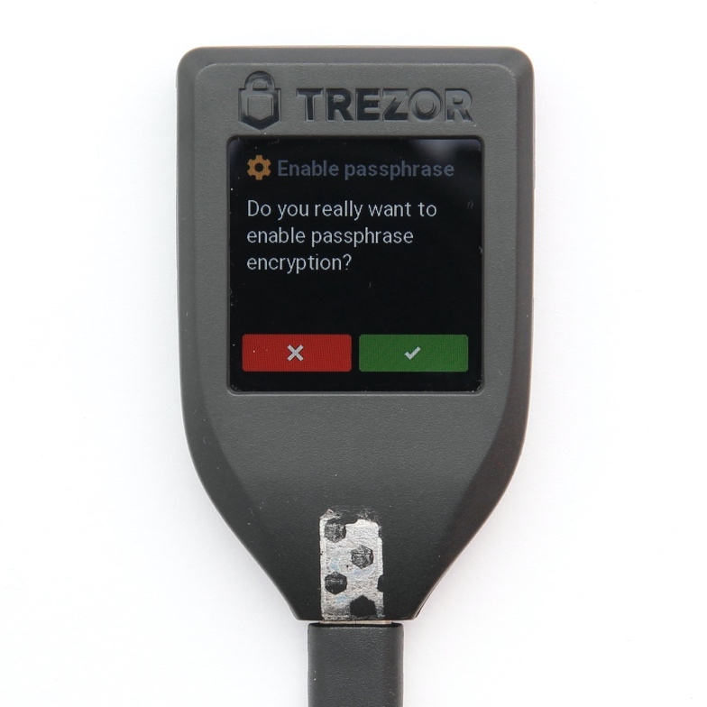

# Pokročilejší postupy

Jak dále zvýšit bezpečnost

Cítíte-li se technicky zdatní nebo máte s ohledem na rozsah vašeho kryptomajetku zájem na sofistikovanějších řešeních? Inspirujte se následujícími doporučeními a zvyšte tak bezpečnost vašeho základního řešení.

## Používejte heslové fráze

Doplňte vaše řešení o tzv. „passphrase“, resp. česky „heslovou frázi“.

Bezpečnost peněženky lze zásadním způsobem zvýšit za použití heslové fráze. Heslová fráze hraje roli při vytvoření vašich klíčů, přičemž k obsahu peněženky se dostanete pouze při její znalosti. Znění heslové fráze si můžete nastavit sami, a to obvykle v pokročilém nastavení některých hardwarových peněženek. Pro heslovou frázi se doporučuje použít několik spolu nesouvisejících slov.

Při použití heslové fráze samotná znalost zálohy nestačí k získání přístupu k daným kryptoměnám. Používání heslové fráze vede k možnosti dodatečného zabezpečení, a to např. tak, že na jedno místo uložíte znění zálohy a na jiné místo znění heslové fráze. Získá-li útočník přístup k jedné z těchto lokací, nebude schopen předmětné kryptoměny odcizit. Na druhou stranu je nutné si uvědomit, že bez znalosti heslové fráze se ke kryptoměnám nedostanete ani vy sami. Zapomenutí nebo nesprávné nastavení fráze (záměnou znaků apod.) tak může mít fatální důsledky!

## Používejte multisignature adresy

Uchovávejte kryptoměny na multisignature adresách.

Další možností, jak diverzifikovat riziko koncentrace tajemství na jedné lokaci, resp. u jedné osoby, je využití tzv. multisignature adres. Tyto adresy umožňují, aby k nakládání s prostředky bylo využito více privátních klíčů.

U multisignature adres lze nastavit, kolik podpisových oprávnění (privátních klíčů) k nim náleží a kolik z nich je nezbytných k provedení transakce. Příkladem může být nastavení multisignature peněženky, ke které existují celkem 4 podpisová oprávnění (tj. 4 samostatné peněženky se samostatnou zálohou a případně i heslovou frází), z nichž k provedení transakce je nezbytná autorizace minimálně 2 z nich. V praxi pak při provádění transakce jeden držitel podpisového oprávnění vytvoří a podepíše transakci a následně ji pošle k autorizaci ostatním oprávněným. Transakce může být přitom provedena pouze tehdy, pokud dojde k autorizaci minimálně od kterýchkoliv 2 držitelů podpisových oprávnění. Držiteli více privátních klíčů (oprávnění) přitom samozřejmě může být i stejná osoba. Využití multisignature adres umožňuje jak diverzifikaci lokací k uložení záloh, tak i diverzifikaci osob, které disponují podpisovým oprávněním.

Aktuálně bohužel neexistuje mnoho uživatelsky přívětivých řešení, která by umožnila nastavení multisignature peněženky s využitím hardware peněženek. Lze tak nicméně učinit například pomocí softwarové peněženky „Electrum Bitcoin Wallet“, kterou lze nalézt na webové adrese electrum.org.

## Uložte si zálohu na více místech

Nebojte se být paranoidní, a ukládejte zálohy v kopiích na více lokacích.

Osvědčené 3-2-1 pravidlo pro tvorbu záloh říká, že byste měli mít vždy alespoň tři „kopie“. Tyto kopie by měly být alespoň na dvou různých typech médií a alespoň jedna kopie by měla být uložena na samostatném místě (offsite). Máte-li tedy privátní klíče například v hardwarové peněžence (1. kopie), k hardwarové peněžence jste zapsali zálohu na papír (2. kopie), druhou papírovou zálohu (tj. 3. kopii) byste měli uložit na separátní lokaci.

Uložení zálohy na určitou lokaci s sebou nese nepředvídatelné riziko její ztráty nebo zničení. Vytvořením a uložením kopie zálohy na jiné místo je toto riziko sníženo. Na druhou stranu je nutné si uvědomit, že se tímto zároveň zvyšuje riziko zneužití ze strany třetích osob, protože nyní máte své tajemství uloženo na dvou místech (resp. u dvou osob).

## Uložte heslové fráze na jiné místo

Uložte znění heslové fráze na jiné místo než s ní související peněženku (ve fyzické podobě) nebo zálohu.

Bezpečnost peněženky či zálohy lze zásadním způsobem zvýšit za použití heslové fráze. Tuto vyšší bezpečnost byste však zcela nevyužili, pokud byste heslovou frázi uchovávali na stejném místě jako související peněženku či zálohu. Výhodou použití heslové fráze je právě skutečnost, že ji můžete uložit na jiném místě. Ten, kdo získá přístup k peněžence či její záloze, totiž bez znalosti heslové fráze nemůže předmětné prostředky nijak zneužít.

## Vyhněte se "DEAD MAN`S SWITCH"

Vzhledem k současnému stavu technologií a některých problematických a nepředvídatelných důsledků je lepší se pro účely automatického převodu kryptoměn konceptu dead man’s switch vyhnout.

„Dead man‘s switch“ je pojistkou pro případ smrti či např. dlouhodobého bezvědomí. V online světě tato opatření zpravidla fungují tak, že vám ve zvoleném intervalu, např. jednou za měsíc chodí e-mail s odkazem, který pokud po delší dobu neprokliknete (nenavštívíte), aktivuje automatické úkony, jako je např. odeslání předem připravené zprávy či přímo kryptoměny na zvolené adresy.

Využití automatizovaných mechanismů pro převody kryptoměn v případech, jako je smrt, jsou lákavým postupem. Bohužel však v současnosti tyto postupy s sebou nesou řadu rizik, které je obtížné nebo které vůbec nelze eliminovat. V prvé řadě může dojít ke spuštění automatizovaných procesů, aniž byste to zamýšleli (např. stále žijete, ale nemáte faktickou schopnost provést pravidelné úkony, které zajišťují, že automatizované procesy se nezahájí). Případně, využijete-li externí osoby či mechanismy jako zdroje vstupní informace, tzv. „oracles“, ty v klíčový okamžik mohou poskytnout nepravdivé informace.

Automatizované mechanismy pro samotný převod kryptoměn rovněž předpokládají, že vaši blízcí mají svoji adresu na všechny druhy kryptoměn, které jim chcete odkázat, umí s kryptoměnami sami nakládat a v neposlední řadě, že budou držet a mít dobře zálohované privátní klíče ke všem takto poskytnutým adresám. Nadto byste museli mechanizmus nezřídka aktualizovat s ohledem na změny ve vašem kryptoměnovém portfoliu. Využití „dead man`s switch“ a jeho implementace pomocí všeslibujích chytrých kontraktů (smart contracts) tedy prozatím raději dejte k ledu.

„Dead man‘s switch“ však může být naopak vhodný pro předání informací vašim pozůstalým o tom, co a jak mají dělat v případě vaší smrti, tedy pro předání návodu, tak jak jej popisujeme dále nebo informace o místě uložení návodu. Informace poskytnuté prostřednictvím „dead man‘s switch“ by nicméně neměly být vysoce citlivé a v žádném případě by neměly obsahovat vaše tajemství (zálohy, hesla, PINy atp.). Snadné řešení pro vytvoření automatického mechanizmu lze nalézt například zde https://www.deadmansswitch.net/, případně lze obdobně využít některé správce hesel. 

## Nepřežeňte to se složitostí

Vlastní řešení nastavte s ohledem na hodnotu uložených kryptoměn a existujících rizik. Mějte rovněž na paměti, že dokonalé zabezpečení neexistuje.

Když to s komplikovaností svého řešení přeženete, může se vám stát, že bude tak „bezpečné“, že se k vašim prostředkům jednou nedostanete ani vy sami. Vždy tedy zvažte, zda stojí za to přidat další prvek, který řešení dělá složitějším. Ne vždy je nejkomplikovanější řešení tím nejbezpečnějším. Obecně platí, že pro většinu lidí jsou vhodná standardní a jednoduchá řešení, u nichž je nejlepší poměr uživatelské přívětivosti a bezpečnosti nebo chcete-li řešení zvolená na základě nákladově-výnosové (cost-benefit) analýzy.