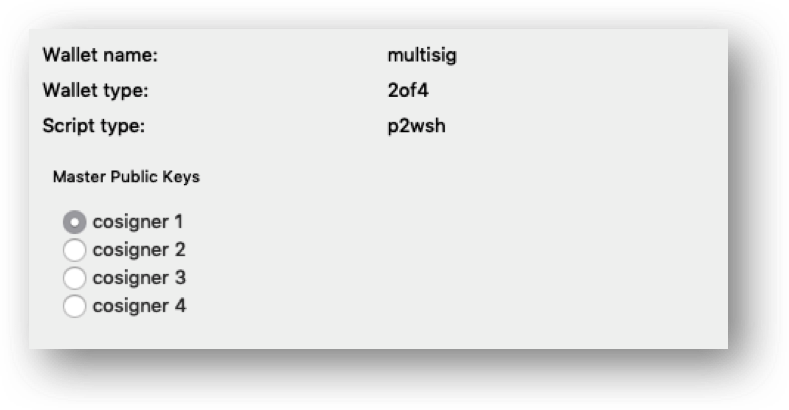
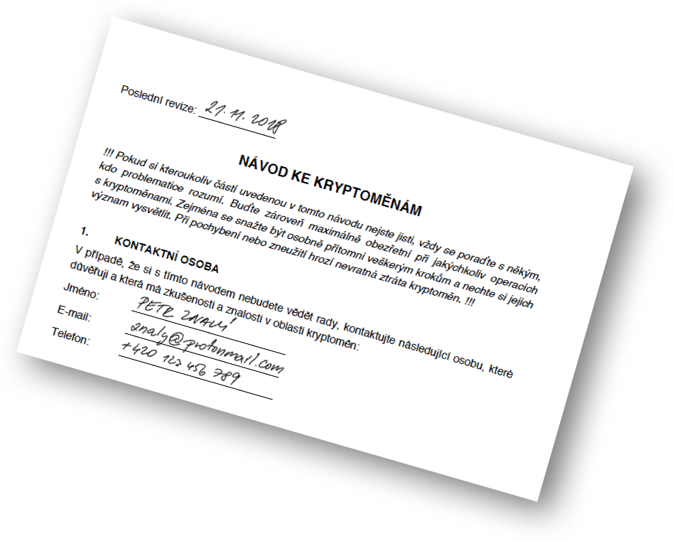

# K návodu

Pro sebe i ostatní

Dokument, který nazýváme „návodem“, je důležitou součástí každého složitějšího řešení. O tom, proč byste měli návod použít, se dozvíte více v další kapitole s názvem „Jak na to“. 

## Návod uložte tam, kde bude s jistotou nalezen

Návod uložte u osoby nebo na místo, kde se v případě vaší smrti včas najde.
Návod je zcela zbytečný, pokud jej po vaší smrti nikdo nenajde. Veškeré vaše úsilí by v takovém případě bylo k ničemu. Proto k návodu nelze přistupovat stejně jako k zálohám peněženek, tedy jako k extrémně zabezpečenému tajemství!
Vhodné je uvažovat o úschově u lidí, kteří se o vaší smrti dozví jako první, tj. vašich blízkých, kamarádech apod., případně u osob, které hrají roli v rámci procesu vypořádání dědictví (např. notář). Co se týká místa, můžete návod zanechat například u sebe doma nebo u blízké osoby, kde předpokládáte, že jej vaši blízcí nepochybně objeví. Techničtější alternativou pak je pro distribuci návodu využít shora popsaný mechanismus „dead man‘s switch“.
Návod zejména neschovávejte do trezoru nebo bezpečnostní schránky v bance, neboť k těmto místům se mohou vaši blízcí dostat až při vypořádání dědictví. I přestože je většina dědických řízení skončena do jednoho roku, ve světě kryptoměn se jedná o relativně dlouhou dobu. Nadto není vyloučeno, že právě vaše dědické řízení se protáhne na několik let.

## Pořizujte návod offline

Pro zvýšení bezpečnosti sepište návod pomocí běžných psacích prostředků, tedy nikoliv na počítači připojeném k internetu.

I u návodu platí, že chcete-li zvýšit pravděpodobnost, že se o obsahu návodu nikdo předem nedoví, vyplňujte jej offline za použití psacích prostředků. 

## Vzdělávejte své blízké v oblasti kryptoměn

Pokuste se své blízké alespoň obecně seznámit s fungováním kryptoměn a jejich riziky.

Vzpomínáte si na první zásadu, „Nechvástejte se“. Tato zásada do jisté míry platí i ve vztahu k vašim blízkým. Nicméně zcela zatajit existenci jakéhokoliv kryptomajektu rovněž nemusí být nejlepším řešením. Vaši blízcí by měli mít minimálně tušení, že jste mohl něco zanechat a že je dobré pátrání po návodu vůbec započít. Rovněž se bude hodit, pokud si nebudou myslet, že Bitcoin, potažmo kryptoměny, jsou dobré tak leda pro drogové dealery či hackery.

Pokud máte ve vaše blízké důvěru, rovněž zvažte, zda s nimi návod krok po kroku neprojít. Může se ukázat, že některé části návodu nejsou tak nad slunce jasné, jak jste se sami domnívali a stejně tak můžete zjistit, že jste na některou podstatnou informaci v návodě zapomněli. Pro tyto účely lze rovněž zvážit použití návodu, který nebude obsahovat konkrétní klíčové informace o rozsahu kryptomajetku či o místě uložení jednotlivých tajemství. 

## Návod neukládejte na stejném místě jako zálohy

Návod neukládejte spolu se zálohami nebo peněženkami na stejná místa, resp. u stejných osob.

Úroveň zabezpečení u záloh, peněženek a jiných tajemství (heslové fráze, master heslo k manažeru hesel apod.) je zásadně odlišná od úrovně zabezpečení uložení návodu. Návod by vaši blízcí měli být schopni najít i v případě, že netuší, o co je jedná. Oproti tomu přístup k ostatním tajemstvím má být výrazně složitější.

## Pořiďte kopie návodu

Uschovejte návod na více místech, resp. u více osob.

Nalezení návodu je zcela klíčové pro úspěch vašeho plánu. Doporučujeme proto návod pořídit dvakrát, ideálně třikrát. Vždy se může stát, že se zároveň s vámi stane něco i dané osobě nebo lokaci. 

