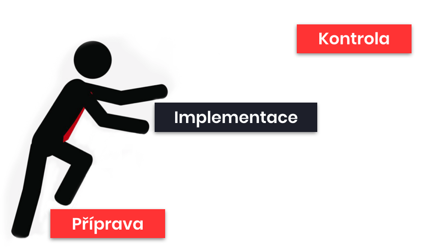
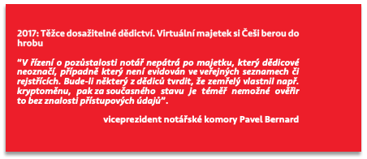

# Jak na to

Z teorie a praxe

Nyní již znáte základní doporučení, kterými se lze řídit při zabezpečení vašich kryptoměn. S touto znalostí můžeme přistoupit k další části, a sice, jak tato bezpečnostní opatření skutečně uvést do praxe. Další postup jsme pro přehlednost rozdělili do tří fází: příprava, implementace a průběžná kontrola.

## Příprava

Co je třeba si rozmyslet

Jakou hodnotu mají mé kryptoměny a jakou mohou mít v blízké budoucnosti?
Pro kryptoměny v hodnotě stovek korun či několika málo tisíc nemusíme vymýšlet řešení s multisignature adresami a uložením záloh v depozitní schránce v bance. Zcela jinak budu pravděpodobně přistupovat k hodnotám pohybujícím se v řádech milionů Kč. Nezapomeňte ale, že hodnota vašich kryptoměn se může v čase dramaticky měnit. Abyste nemuseli své řešení neustále upravovat, je vhodné počítat s vyšší než aktuální hodnotou a nastavit řešení spíše robustněji.

Mezi kolik typů peněženek chci své kryptoměny diverzifikovat a jak? Případně, chci využít uložení u třetích osob?

Rozmyslete si, kolik peněženek a jakého typu byste chtěli využít. Z vašeho rozhodnutí následně vyplyne, kolik různých záloh nebo zařízení budete muset bezpečně uložit.

Jaká důvěryhodná místa, na které můžu uložit zálohy nebo peněženky, mám k dispozici?

Vhodné je zvolit alespoň dvě na sobě nezávislá místa, abyste v případě úspěšného útoku nepřišli o veškeré prostředky.

Které osobě mohu důvěřovat, že poradí mým pozůstalým, pokud se mi něco stane?
Zvolte minimálně jednu důvěryhodnou osobu, která se v oblasti kryptoměn orientuje a bude schopna a ochotna pomoci vaším pozůstalým získat přístup k vašim kryptoměnám a rovněž jim poradit ohledně jejich dalšího uchovávání nebo zpeněžení.

Na základě výše uvedeného vytvoříte základní kostru řešení uchování vašich kryptoměn spočívající v rozvržení kryptoměn ve vztahu k různým technologiím a volbě způsobů a míst, na kterých budete ukládat vaše tajemství, jako jsou návod, zálohy, heslové fráze, nebo peněženky. 

## Implementace

K věci

V rámci této fáze byste měli vytvořit (pořídit) peněženky a zálohy a uložit je na bezpečná místa. Dále byste měli vytvořit dokumentaci skládající se z návodu a přehledu kryptomajetku a uložit je na vhodné místo.

### Vytvoření peněženek a záloh

VZOR - příloha č. 1

Ve vztahu ke každé peněžence by měla být vytvořena záloha (je-li to u ní možné). Pro účely vytvoření zálohy můžete použít vzor, který naleznete v příloze č. 1 této příručky. 

Nezapomeňte k záloze vždy zapsat datum jejího pořízení, název kryptoměn, kterých se týká, a využívaný software (jedná-li se o peněženku na telefonu nebo desktop zařízení) nebo hardware (jedná-li se o hardwarovou peněženku).
Do poznámky můžete napsat veškeré další informace, které byste měli vy nebo jiná osoba získat spolu s danou zálohou, případně jakékoliv další informace, které uznáte za vhodné (např. pokud vzor nebude zcela vyhovovat). Může se jednat například o informace k postupu při použití zálohy, místě uložení peněženky, přístupovým údajům do telefonu či počítače nebo kde hledat heslovou frázi. 

### Vytvoření návodu

VZOR - příloha č. 2

Vytvoříme-li nádherné a funkční řešení, ale nikde si jej v detailu nepopíšeme, riskujeme, že:

a)	Zapomeneme, jaké řešení je (zvláště, je-li složitější povahy).

b)	Něco se nám stane a naši pozůstalí jej nebudou schopni rekonstruovat.

c)	V lepším případě extrémně zkomplikujeme situaci naším blízkým hledáním přístupů a trvající nejistotou o rozsahu zanechaného kryptoměnového majetku.

V prvních dvou případech hrozí nevratná ztráta prostředků. Ve třetím případě si naši blízcí po smrti najmou Sherlocka Holmese vyškoleného v oboru kryptoměn a ten s vynaložením podstatného úsilí úspěšně vystopuje, co po vás zbylo a jak se k tomu bezpečně dostat.

Uvedeným scénářům snadno předejdete prostřednictvím pořízení návodu, tedy jakousi „mapou pokladu“, kterou uložíte na vhodné, přiměřeně dostupné, místo. 

Jak by mohl takový návod vypadat? Jako inspiraci pro vytvoření vašeho návodu jsme připravili vzor, který je přílohou č. 2 této příručky. Návod obsahuje několik sekcí, a sice:

1)	**Kontaktní osoba**
Návod vytváříte primárně pro své blízké pro případ, že se vám něco stane. Proto dává smysl jako první informaci, kterou si vaší blízcí v návodě přečtou, uvést osobu, na kterou se mohou obrátit s žádostí o pomoc. 
Neuvedete-li důvěryhodnou kontaktní osobu, hrozí, že vaši blízcí (nejsou-li znalí oblasti kryptoměn) se obrátí na osoby, které jejich nevědomosti a zranitelnosti snadno zneužijí ve svůj prospěch. Stejně tak mohou vaši blízcí zcela bezelstně některé citlivé informace uveřejnit při snaze získat pomoc v situaci, ve které si absolutně neví rady. Lze například předpokládat uveřejnění zálohy na online fórech s dotazem, jak s uvedenými slovy naložit.

2)	**Přehled majetku**
Tato část návodu obsahuje informaci, kde lze nalézt přehled vašeho kryptomajektu. Vzhledem k tomu, že přehled může být aktualizován častěji než návod, může být praktické jej ukládat na odlišných místech.
Přehled kryptomajetku, který je průběžně aktualizovaný, může zjednodušit mnoho praktických problémů při vypořádání kryptomajetku po vaší smrti. Nejenže díky němu budete mít sami průběžný přehled o tom, co kde máte, ale zároveň usnadníte práci vašim blízkým při zjišťování, co po vás vlastně zůstalo a po čem je dobré pátrat. Díky sepsání přehledu kryptomajetku si rovněž ověříte, že jste při vytváření záloh a návodu na žádné „coiny“ nezapomněli. V neposlední řadě vám pak vedení aktuálního přehledu zjednoduší způsob nakládání s kryptomajetkem v rámci tzv. „pořízení pro případ smrti“, jako je především závěť, případně dědická smlouva či dovětek (viz dále).
Pokud i přes výše uvedené přehled kryptomajetku nebudete chtít vyhotovit, můžete tuto část návodu zcela vypustit.

3)	**Hesla, PINy, 2FA**
Pokud se řídíte doporučeními uvedenými v úvodní části této příručky, je takřka jisté, že si nepamatujete všechna svoje hesla a používáte manažer hesel. Tato část slouží k tomu, aby vaši blízcí získali možnost dispozice s vašimi přístupovými údaji a hesly a PINy, které mohou být nezbytné zejména k získání přístupu na platformy třetích osob.
Není-li používání manažera hesel navázáno na další bezpečnostní opatření (např. používání hardware tokenu, funkce, ke které je možné využít také třeba hardwarovou peněženku Trezor), lze doporučit uschování tzv. master hesla stejně jako by se jednalo o zálohu kryptoměnové peněženky. Master heslo je extrémně citlivé, neboť pokud se k němu dostane neoprávněná osoba, může získat přístup k veškerým vašim heslům.

4)	**HW, papírové a SW peněženky**
Cílem těchto sekcí je uvést, na kterých místech a případně u kterých osob jsou uschována tajemství, která se s nimi pojí (tj. zálohy, heslové fráze nebo případně peněženky ve fyzické podobě).

5)	**Kryptoměnové burzy**
Tato část vysvětluje, jakým způsobem se blízcí mohou dostat k přístupu na vaše účty u třetích osob, jako jsou zejména provozovatelé kryptoměnových burz či jiných online účtů (pokud takové účty využíváte).

6)	**Postup**
Tato část je skutečně projevem povahy návodu jako „mapy k pokladu“. Chcete-li to svým blízkým zjednodušit ještě více, napište jim zde krok za krokem, jak mají postupovat. Současně si tak ověříte, že jste na žádné přístupové údaje či jiné podstatné informace ve svém návodu nezapomněli.

### Vytvoření přehledu kryptomajetku

Co se týče přehledu kryptomajetku, tento by měl zachycovat vaše prostředky na všech peněženkách a rovněž možné vklady u třetích osob (zejména prostředky na kryptoměnových burzách), a to k určitému dni, který v dokumentu uvedete.

Možný vzor naleznete v příloze č. 3 této příručky. Návrh předpokládá seřazení pod dílčí kryptoměny, nicméně lze to samozřejmě udělat i tak, že jej seřadíte dle dané platformy či zařízení. Nezapomeňte vždy uvést dostatečnou identifikaci (např. jméno HW peněženky, pokud disponujete větším počtem).

Výborně! Jak ale poznáte, že zvolené nastavení je to „správné“? Těžko. Asi se totiž nebudete pouštět do ostrého testování vlastním úmrtím nebo zničením hardwarových peněženek, ke kterým jste vytvářeli zálohy. Můžete nicméně vyzkoušet alespoň to, že si představíte (vymyslíte) několik variant situací, které se mohou stát a pokusíte se zahrát si na osobu, která by se k vašim prostředkům měla dostat, případně na osobu, která by k vaším prostředkům neměla dostat, ale chtěla by. Vaše opatření rovněž můžete v anonymizované podobě vyzkoušet na vašich blízkých.

## Kontrola

Skoro bychom zapoměli

Poslední fází uvedení vašeho řešení do života je jeho průběžné udržování a aktualizace.  Za tímto účelem je vhodné nastavit si pravidelné intervaly, ve kterých budete kontrolovat, zejména, že: (1) Aktuální stav odpovídá informacím v návodu (tedy především způsob uložení, místa a určené osoby); (2) Zálohy jsou stále přístupné a čitelné a nebylo s nimi neoprávněně manipulováno; (3) A koneckonců i to, že vaše kryptoměny stále leží na stejných adresách. 

