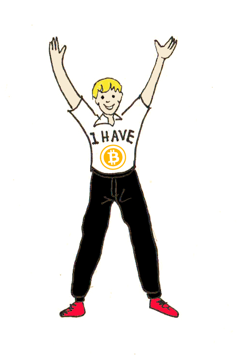

# Předmluva

## Čeho chceme dosáhnout

Nemá smysl zde vysvětlovat, jaký potenciál kryptoměny mají a jak mohou změnit svět. Pokud čtete tyto řádky, pravděpodobně již kryptoměny vlastníte a věříte, že jste součástí technologické a finanční revoluce.

Alfou i omegou kryptoměn je, že je můžete mít plně pod kontrolou. Držíte-li privátní klíče k vaší kryptoměně, nepotřebujete souhlas jakékoliv třetí osoby k jejímu převodu a nikdo vám ji bez vaší součinnosti nevezme. Svoboda a nezávislost jsou však pouze jednou stranou mince. Její stinnou stranou je odpovědnost za vlastní chyby, která s sebou často nese kruté a nevratné následky.

Mnoho z nás při správě vlastních kryptoměn nedodržuje základní bezpečnostní doporučení, chybuje při vytváření záloh nebo vynalézá pasti na útočníky, do kterých se pak sami chytí. Stejně tak máme tendenci nepřemýšlet nad tím, co bude, až sami nebudeme, a jestli se někdo k našim kryptoměnám dostane, pokud by se nám něco stalo. Z novin se pak dozvídáme kuriózní příběhy o prohledávání skládek, kde se na vyhozených harddiscích povalují miliony dolarů v bitcoinech, o terapii hypnózou, která má vyvolat zapomenutý PIN či o likvidaci kryptoměnových záloh manželkou při úklidu. 

Tento e-book je určen těm z vás, kteří jste v oblasti kryptoměn noví a chcete k nim přistupovat obezřetně. Stejně tak je určen vám, kteří už se v oblasti pohybujete delší dobu, ale zatím jste rizika nakládání s kryptoměnami příliš neřešili anebo jen hledáte inspiraci pro vylepšení vašeho systému uložení a záloh. Ostatně ruku na srdce, kdo s ohledem na mládí těchto technologií není v oboru nováčkem. E-book je nadto určen všem, kterým není lhostejné, co se stane s jejich kryptobohatstvím po smrti.

# O čem

## Co se dozvíte

E-book začíná kapitolou „Tipy a triky“ obsahující doporučení, jak s kryptoměnami nakládat. Jednotlivá doporučení jsou rozdělena do různých kategorií, a to od obecných až po ty, které se dotýkají specifických technologií. Mnoho z doporučení se netýká pouze kryptoměn, ale obecně bezpečného pohybu v online prostředí. Účelem první kapitoly je poskytnout přehled o specifikách vlastnictví kryptoměn, možných rizicích a souvisejících řešeních. Některá z doporučení jsou zároveň pro ilustraci doplněna odkazy na reálné příběhy těch méně šťastných, kteří se doporučeními neřídili.

Praktickou aplikaci uvedených doporučení si pak představíme v další kapitole „Jak na to“. V této části se dozvíte, jak krok za krokem postupovat při tvorbě vlastního systému úschovy a zálohování kryptoměn, tak aby vyhovoval vašim individuálním potřebám.

Třetí částí e-booku je kapitola „Pro případ smrti“. Dozvíte se, co se s kryptoměnami stane v případě vaší smrti a jaké kroky ještě za života podniknout, aby s vašimi kryptoměnami bylo naloženo tak, jak si přejete.
Pro zjednodušení v příručce pracujeme s pojmem kryptoměn. Těmito máme nicméně na mysli veškerá kryptoaktiva v širším slova smyslu, tedy nejen virtuální měny, ale rovněž nejrůznější typy digitálních tokenů.

